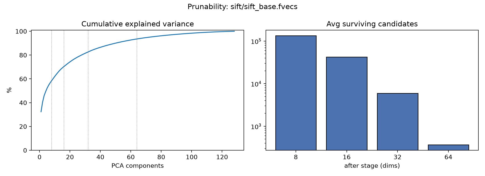

# Hierarchical PCA Pruning for Exact Nearest Neighbor Search

[](https://doi.org/10.5281/zenodo.21387358)
[](https://github.com/taiwuchiang-gmail/hierarchical-pca-search/actions/workflows/ci.yml)
[](https://opensource.org/licenses/MIT)

This repository contains the official implementation for the paper:  
**"A Hierarchical Pruning Algorithm for Fast, Exact Nearest Neighbor Search in High-Dimensional Spaces"** (VLDB '26 / Zenodo 2026).

## Overview

Finding the exact nearest neighbor in high-dimensional space is bottlenecked by the "Curse of Dimensionality," particularly the I/O costs of loading full vectors (e.g., 128-D) from disk. 

This repository implements a **Dynamic Top-K Branch and Bound algorithm** using PCA and the L2 Euclidean norm. By evaluating candidates in progressively higher dimensions (8D $\rightarrow$ 16D $\rightarrow$ 32D $\rightarrow$ 64D), the algorithm mathematically guarantees 100% exactness while safely pruning **over 99.9% of the candidate space** before performing a full-dimensional distance calculation.

### Results on SIFT1M
* **10.2x algorithmic work reduction:** 12.6M per-dimension distance terms per query vs the 128.0M of any exhaustive scan (hardware-independent count; see Paper II for the accounting).
* **4.3x reduction** in query latency vs a vectorized NumPy brute-force baseline (float64 regime; ~2.7x in float32 — see Paper II for why wall-clock constants differ from work counts).
* **Reduces disk I/O exponentially:** Out of 1,000,000 vectors, an average of only 564 vectors require full 128-D evaluation, and only 8–40 bytes/vector of metadata must stay resident (vs 512 B/vector for raw vectors).

## Installation

```bash
git clone https://github.com/taiwuchiang-gmail/hierarchical-pca-search.git
cd hierarchical-pca-search
pip install .
```

Only NumPy is required. `pip install ".[full]"` adds the optional extras:
scikit-learn (faster offline k-means fit; a pure-NumPy fallback is built in),
matplotlib (diagnostic plots), and joblib/tqdm (used by `benchmark.py`).
Installation also provides the `pca-diagnose` command-line tool.

## Quick Start (Benchmarking)

To run the SIFT1M benchmark and reproduce the results from the paper:

```bash
python benchmark.py
```

**What this script does automatically:**
1. Downloads and extracts the [SIFT1M dataset](http://corpus-texmex.irisa.fr/) (if not present).
2. Fits a PCA model on the 1,000,000 base vectors and saves it (offline indexing).
3. Runs 100 randomly selected queries using both the **Vectorized Brute-Force Baseline** and the **Hierarchical PCA Search**.
4. Verifies 100% exactness (zero false dismissals).
5. Generates a logarithmic bar chart (`figures/pruning_effectiveness.png`) showing the candidate drop-off at each dimensional cascade.

## Will it help *your* data? (prunability diagnostic)

The speedup depends entirely on how **correlated** your dimensions are: correlated data
concentrates variance in a few PCA components (fast eigenvalue decay), which makes the
low-dimensional lower bounds tight and the pruning aggressive. Uncorrelated data (flat
eigenvalue spectrum) gives loose bounds and no benefit.

`diagnose.py` measures this on a sample of *your* vectors in seconds, before you
integrate anything:

```bash
python diagnose.py your_vectors.npy        # or .fvecs
python diagnose.py --demo                  # synthetic tour: watch the verdict flip
                                           # as correlation weakens
```

It reports the eigenvalue decay, runs the actual pruning cascade on the sample
(verifying exactness against brute force), and prints measured survivor rates, the
fraction of full vectors touched (your out-of-core I/O cost), a wall-clock speedup,
and a plain verdict:

```
VERDICT: STRONG   -- highly correlated data; pruning will pay off.
VERDICT: POOR     -- dimensions too uncorrelated (flat eigenvalue decay);
                     bounds are loose, use brute force / ANN instead.
```

Rule of thumb: if 95% of the variance fits in a small fraction of the dimensions,
this method will prune hard; if it needs nearly all dimensions, it won't. Only
numpy is required (matplotlib optional, for `--plot decay.png`).

### Validation: the diagnostic reproduces the paper's SIFT1M results

Running `diagnose.py` on the full SIFT1M base set recovers the paper's measured
cascade stage-by-stage, from a single command:

| stage | paper (Fig. 1) | `diagnose.py` (1M) |
|---|---|---|
| after 8D | 146,955 (14.7%) | 135,356 (13.5%) |
| after 16D | 52,107 (5.2%) | 42,322 (4.2%) |
| after 32D | 7,896 (0.8%) | 5,953 (0.6%) |
| after 64D | 564 (0.056%) | 366 (0.04%) |
| speedup | 4.3x | 5.0x |
| exactness | 100% | 100/100 |

(Small deltas are expected: the diagnostic uses held-out base vectors as queries,
so it works on any `.npy`/`.fvecs` file without a separate query set.)



The left panel is the cause (SIFT's first 8 PCA dims hold 58.5% of the variance —
strongly correlated dimensions); the right panel is the effect (candidates drop
four orders of magnitude through the cascade).

## Hybrid index: ball (k-means) bound + PCA cascade

`hybrid_search.py` adds a second, complementary family of exact lower bounds.
For a point `p` in a k-means cluster with centroid `c` (and stored offline
distance `d_p = ||p - c||`), the triangle inequality gives:

```
||q - p||  >=  | ||q - c|| - d_p |
```

This bound needs **no distance computations at query time** — one gather and
one subtraction per point, after `k << N` centroid distances. It is exact for
*any* centers (quality only affects speed, never correctness), and it is tight
exactly where the PCA bound is loose: clustered / multimodal data. The hybrid
query runs the ball stage first, then the PCA cascade on the survivors.

```bash
python hybrid_search.py demo    # PCA-hostile vs PCA-friendly showcase
python hybrid_search.py sift    # SIFT1M, official queries
```

Measured on SIFT1M (100 official queries, float32, exactness verified per
query — Paper II, Table 2):

| method | ms/query | speedup | cascade survivors |
|---|---|---|---|
| brute force (NumPy) | 167.3 | 1.0x | — |
| PCA-only (Paper I) | 61.1 | 2.7x | 14.7% / 5.2% / 0.8% / 0.06% |
| hybrid (ball + PCA) | 62.2 | 2.7x | ball 50.6% -> 14.6% / 5.1% / 0.7% / 0.05% |

On SIFT the ball level is a wall-clock **tie**: it prunes only ~50% before
the PCA cascade, and the bound evaluations cost what they save — which is
exactly what the diagnostic's measured trial predicts (`SKIP`) from a 100k
sample. Where the data *is* clustered the same level dominates: on "many
tight clusters" data (flat eigen-spectrum) the hybrid reaches **13.9x** vs
2.1x for PCA-only, and on latent-dim-8 Gaussian data 5.6x vs 2.1x. The
ball level's value is monotone in its survivor rate (3% -> 4–14x,
15–23% -> 2–3x, ~50% -> tie, 100% -> slower); see Paper II (`paper2/`) for
the full measurements and the hardware-independent work accounting.

`diagnose.py` decides whether the ball level is worth adding for *your* data
with a three-tier funnel: (1) the eigen curve rates the PCA levels, (2)
kurt(PCA)/sqdep statistics detect structure beyond the covariance, and (3) a
measured trial of the real hybrid cascade on your sample delivers the verdict
(`ADD` / `SKIP`), because the statistics nominate but the measurement decides.

## Understanding the Code

The core of the logic is inside `hierarchical_pca_1nn_l2` in `benchmark.py`. 
It utilizes a **Top-50 Probe**: at the lowest dimensional representation (8D), it identifies the 50 closest candidates and immediately computes their full 128D distance. The absolute minimum of these 50 becomes a mathematically guaranteed, tight upper-bound radius for pruning the remaining 999,950 vectors.

## Tests

The exactness guarantee is enforced by an automated test suite (no dataset
download needed — it runs on synthetic data in a few seconds):

```bash
pip install -e ".[test]"
pytest
```

It verifies, per query and on three data regimes (clustered / low-rank /
i.i.d.), that every query path returns the brute-force nearest neighbor,
checks the `count_ops` work accounting against hand-computed values, and
exercises the diagnostic funnel's verdicts. CI runs the suite on every push,
including once without scikit-learn to cover the pure-NumPy k-means fallback.

## Contributing

Bug reports and pull requests are welcome — see
[CONTRIBUTING.md](CONTRIBUTING.md). The one non-negotiable invariant: bound
quality may affect speed, never correctness.

## Citation

If you use this code in your research, please cite (the concept DOI always
resolves to the latest version):

```bibtex
@misc{chiang2026hierarchical,
  title={A Hierarchical Pruning Algorithm for Fast, Exact Nearest Neighbor Search in High-Dimensional Spaces},
  author={Chiang, Tai-Wu},
  publisher={Zenodo},
  year={2026},
  doi={10.5281/zenodo.21387358},
  url={https://doi.org/10.5281/zenodo.21387358}
}
```

The hybrid-bound sequel ("Composable Exact Bounds", Paper II) lives in
[`paper2/`](paper2/).

## License
[MIT](LICENSE)
